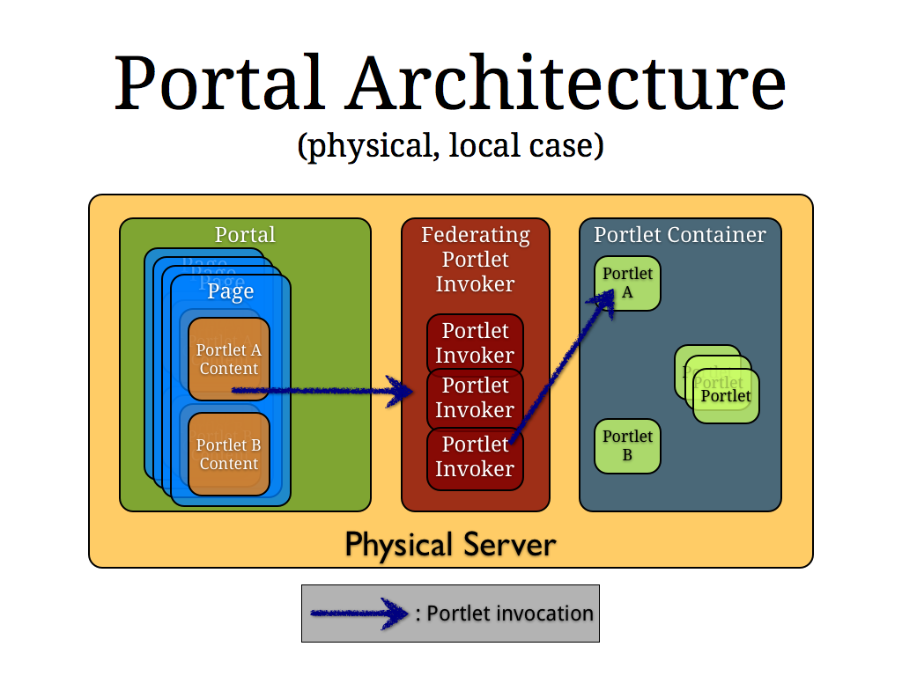
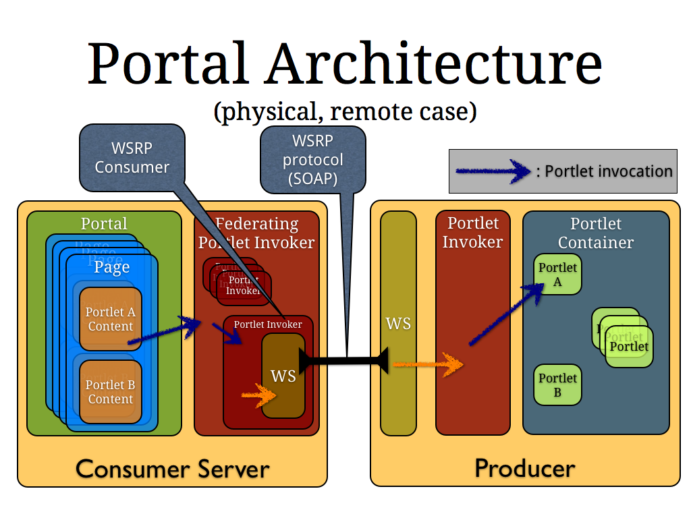

# GateIn WSRP

This project implements [Web Services for Remote Portlets (WSRP)](http://www.oasis-open.org/committees/wsrp) for GateIn. It builds mainly on top of the
[gatein/gatein-pc](http://github.com/gatein/gatein-pc) and [gatein/gatein-common](http://github.com/gatein/gatein-common) projects.
This document provides a technical overview of the project.

## Architecture overview

### Concepts

The core principle of GateIn's WSRP implementation is that, from the portal's perspective, there should be no difference between a local and a remote portlet. This is achieved
using the concept of `PortletInvoker` that is defined by GateIn's portlet container (`gatein/gatein-pc` project). `PortletInvoker` is an interface that defines all the methods a
client of the portlet container needs to interact with its portlets. GateIn's portlet container also introduces the idea of `FederatingPortletInvoker` which is a Composite
implementation of `PortletInvoker`, meaning that it presents itself as a regular `PortletInvoker` but in reality, aggregates several `PortletInvoker`s and contains logic to
dispatch portlet invocations to the proper `PortletInvoker` based, usually, on the target portlet.

Conceptually, WSRP portlets are portlets that live in a portlet container that happens to live and run in a distant server. Coding the portal in terms of the `PortletInvoker`
interface allows us to abstract over the fact that some portlets are local, running in the embedded portlet container, and some others are distant, running on remote WSRP
producers. A portal can access portlets from several, different remote producers. This is accomplished by creating a consumer for each accessed producer and registering it with the
`FederatingPortletInvoker` which will then be able to dispatch a portlet invocation to the proper consumer (or the local portlet container) based on the identifier of the portlet
being interacted with.

From the producer's side of things, i.e. the remote side of things when WSRP consumers interact with it, we again use the `PortletInvoker` interface, this time as a client to the
portlet container running in the GateIn instance the producer is fronting over WSRP. The producer is, thus, a mini portal that interacts with the local `PortletInvoker` and acts
as a proxy for the remote consumer, translating WSRP messages into `PortletInvoker` method calls in such way that the portlet container needn't be aware that calls to it actually
originates from remote consumers.

The WSRP implementation, for a GateIn-to-GateIn interaction, is, in essence, a means to identify the proper portlet container able to respond to the portlet invocation triggered
by the consumer portal and convert it into a portlet invocation that can be processed by the producer's portlet container after having transported it over the network using SOAP
messages.

### WSRP 1 vs. WSRP 2

WSRP 2 can be seen (more or less) as a super-set of WSRP 1. For this reason, we chose to implement only WSRP 2 and convert WSRP 1 calls into WSRP 2 using a thin conversion layer.
This allows for less code duplication and allows us to focus on the quality of the WSRP 2 implementation as this would trickle down to WSRP 1 functionality automatically.

### Modules

GateIn WSRP implementation is organized by modules roughly corresponding to functional parts:

1. `admin-gui` provides a GUI interface to configure many aspects of both consumers and producer. This is a JSF 2 application, bundled as a portlet using JBoss' PortletBridge
2. `api` provides an API helpful to integrate this WSRP implementation in the context of a portal, i.e. it defines classes which require an implementation at the portal level for
   many WSRP services to work properly or extension points for WSRP users to provide customized behavior
3. `common`, as its name implies, provides a set of classes reused across the different modules, in particular a set of utilities to create WSRP types, convert between the portlet
   world and the WSRP one, deal with converting between versions 1 and 2 of WSRP types, payloads, etc.
4. `consumer` provides the implementation of the consumer-side of WSRP
5. `cxf-integration` implements support classes to integrate WSRP with Apache CXF features
6. `examples` provides sample code showing how to implement custom behaviors that can be plugged in our WSRP implementation to adapt it to users' needs
7. `hibernate-impl` is currently an unused, outdated and incomplete version of the persistence services required by the implementation
8. `jcr-impl`, in turn, provides a complete and currently used implementation of the persistence services that WSRP uses to save its data
9. `producer` provides the code for the WSRP producer side of things
10. `ws-security` provides classes to integrate WS-Security with WSRP and provides a JBoss AS 7 specific implementation
11. `wsrp1-ws` and `wsrp2-ws` provide the WSRP classes as generated, for reference, by the provided scripts from the official WSRP WSDL files
12. `wsrp-catalog` is a module dedicated to providing JAX-WS catalog support to facilitate the resolution of WSRP artifacts by web services implementations. This is mainly needed
    to provide such resolution across all the different AS-level modules in JBoss AS 7
13. `wsrp-producer-war` bundles all the code and artifacts required to provide a WSRP producer as a web application

### Documentation

More detailed documentation is available in javadoc format in classes of particular interest. We provide, below, a brief overview of the most important modules along with their
more important classes which should be looked at first. Tests also provide valuable information as to expected behavior of classes and therefore can be useful to understand the
code and its purpose.

## Consumer Overview

The core of the module is, of course, the `WSRPConsumer` interface which inherits from the gatein/gatein-pc `PortletInvoker` interface. It also extends the `SessionEventListener`
interface from the `api` module to allow it to react to session events the portal the consumer runs into might send and trigger the appropriate WSRP calls. Classes of particular
interest are `WSRPConsumerImpl`, `ProducerInfo`, `InvocationDispatcher`, `InvocationHandler` and `SessionHandler`. The session information associated with a given producer and its
portlets is recorded using the `ProducerSessionInformation` class.

WSRP consumers are registered and managed by a `ConsumerRegistry` that takes care of configuring, persisting and dealing with consumers lifecycle. `AbstractConsumerRegistry`
provides the common behavior for `ConsumerRegistry` implementations.

## Producer overview

todo

## Persistence overview

todo

## Integration in GateIn

todo